# 싹 다 끄고 새거로 다시 켜기

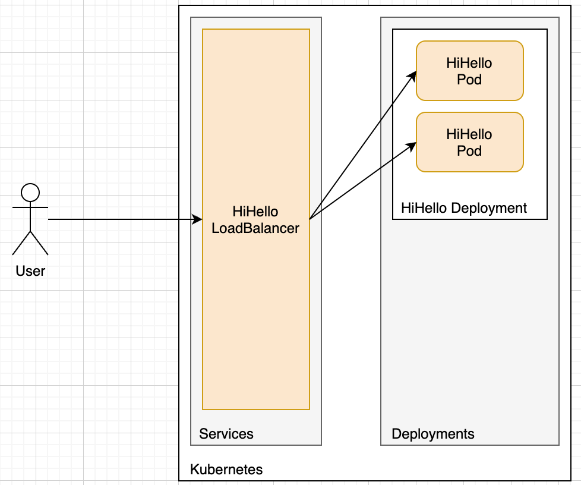

로드밸런서 1개 + 파드 n개 로 구성한 상황에서 시작합니다.

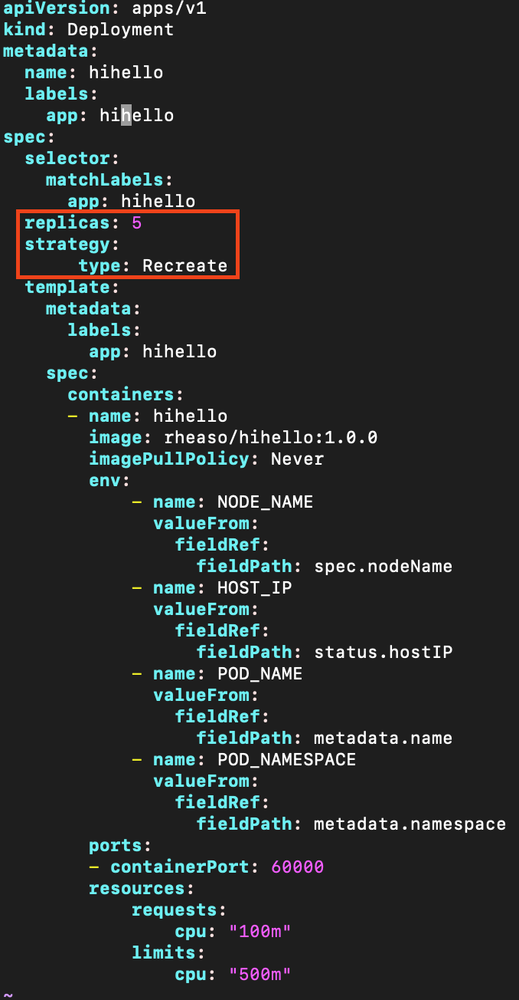

Deployment에 변경사항이 있을때마다 싹 다 끄고 새거로 키고 싶은 경우 strategy에 ReCreate라고 명시하면 됩니다.

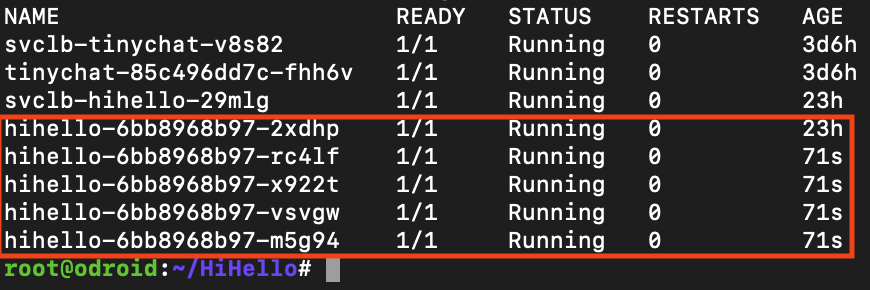

테스트를 위해 Pod를 5개 띄워놓았습니다.

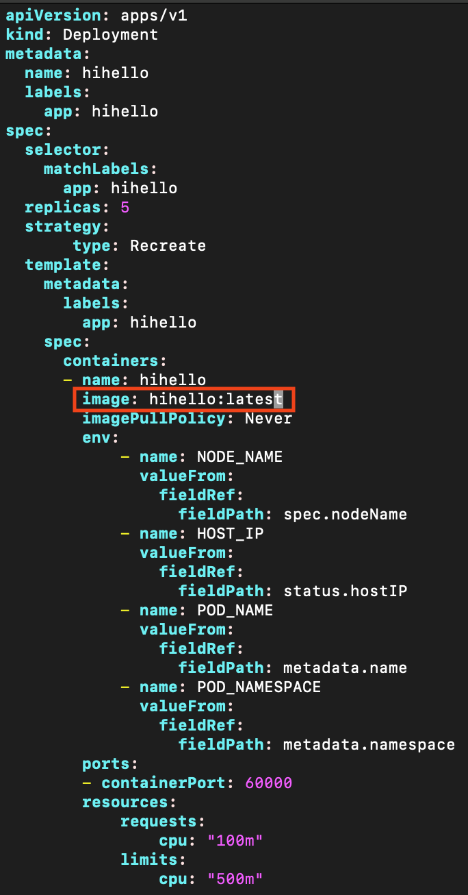

Pod의 Docker Image를 다른 것으로 변경했습니다.

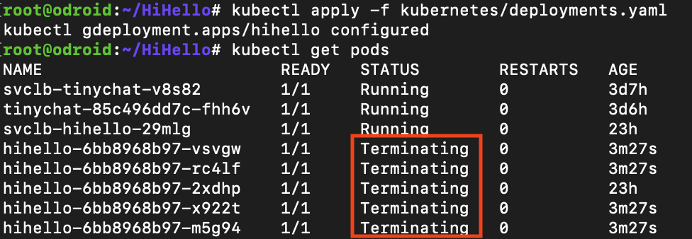

변경하자마자 기존에 띄워져있던 모든 Pod들이 제거되기 시작합니다.

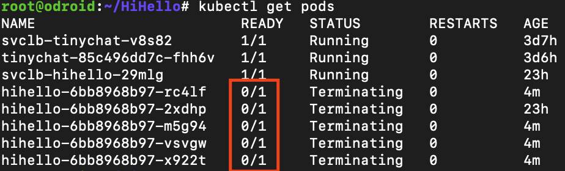

최종적으로는 모든 Pod들이 꺼졌습니다.

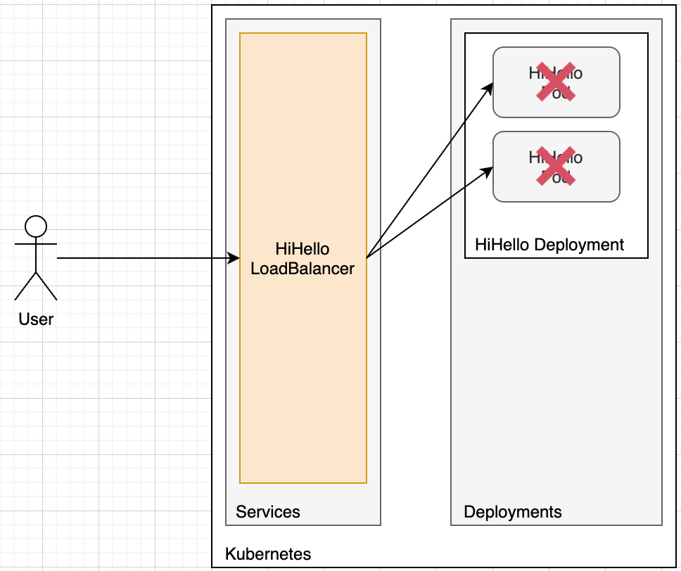

이제 고객들은 연결할 서버가 없어서 장애를 겪게 됩니다! (504 Gateway Timeout)

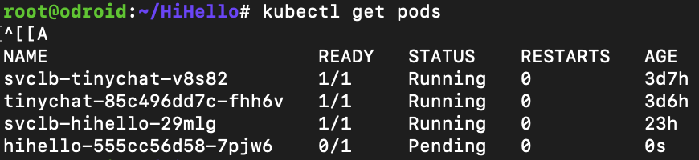

이후, 천천히 새로운 Docker Image를 사용하는 Pod가 띄워지기 시작합니다.

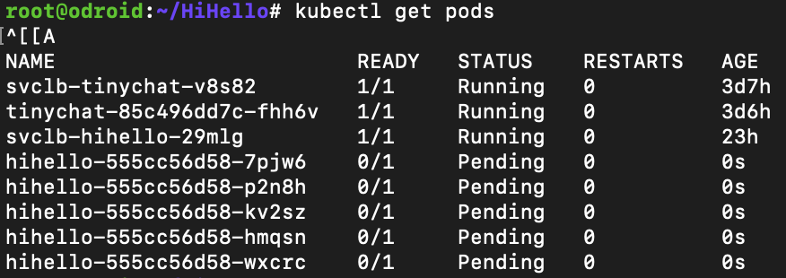

쫘라락 띄워지기 시작합니다.

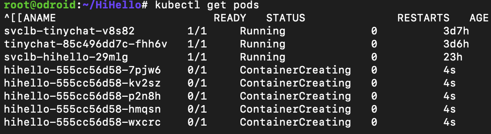

ContainerCreating...!

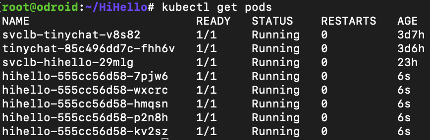

새로운 서버의 배포가 끝났습니다.!

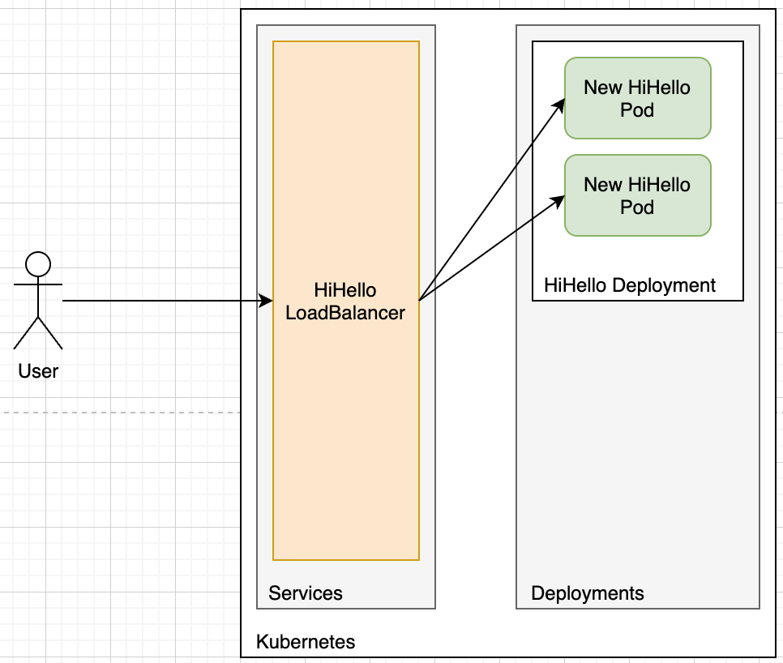

다시 새 서버들이 띄워져서 고객들이 서버에 연결을 할 수 있게 됩니다.

```sh
artillery quick --duration 60 --rate 30 -n 20 http://192.168.0.36:60000/
```

서버가 꺼지고 새로 켜지기 시작하는 동안 고객들이 서버에 연결을 못하는 것을 테스트하기 위해 부하를 줘봤습니다.

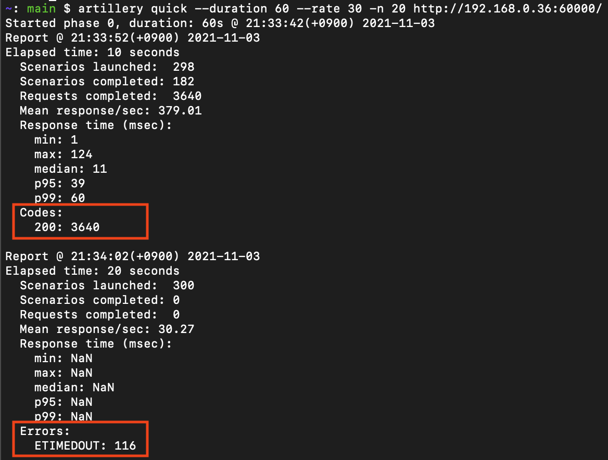

처음에는 요청이 잘 처리되다가, 서버가 바뀌는 동안에는 ETIMEDOUT이 발생하는 것을 확인할 수 있습니다!

버그 수정이나 기능 추가등을 위해 서버를 ReCreate 방식으로 배포했다간,  
오히려 유저의 원성을 살 수 있다는 것이 느껴집니다..

다음 문서부터는 ETIMEDOUT이 발생하지 않는 무중단 배포 방식을 알아보도록 하겠습니다.
