# 하나씩 새걸로 바꿔켜기

저번 문서에서 모든 서버를 다 내려버리고 새 서버를 다시 띄우는 사이 들어오는 고객들의 요청을 처리하지 못하는.. ReCreate 배포 방법에 대해서 알아보았습니다.

이번 문서부터는 모든 요청을 처리하면서, 안전하게 서버를 배포하는 방법에 대해서 알아보도록 하겠습니다.

이 문서에서는 서버를 하나씩 교체하는 방법을 설명합니다.

먼저 서버를 위와 같이 띄워놓습니다.

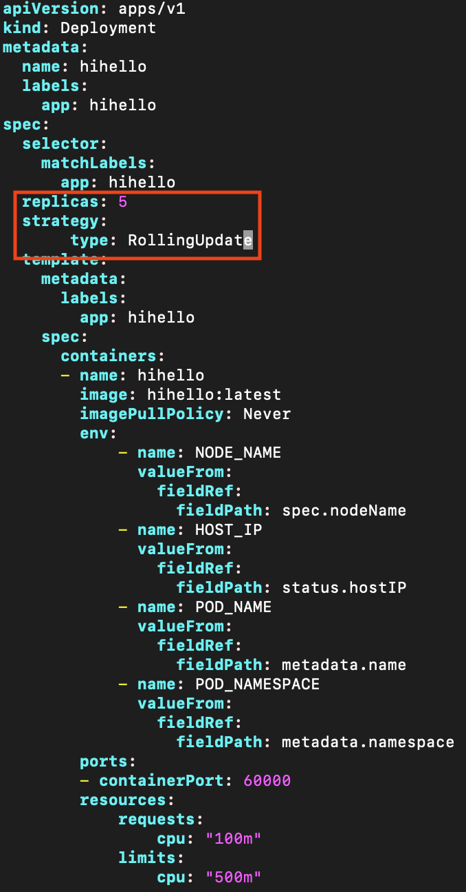

우리가 하면 되는 것은 ReCreate때와 동일하게, RollingUpdate로 명시하는 것이 끝입니다.

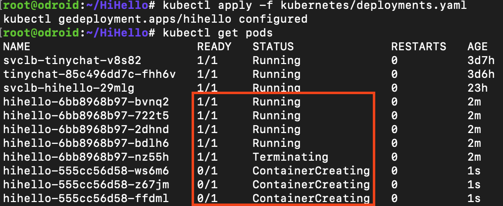

Docker Image를 변경하자마자, Pod가 교체되기 시작합니다.

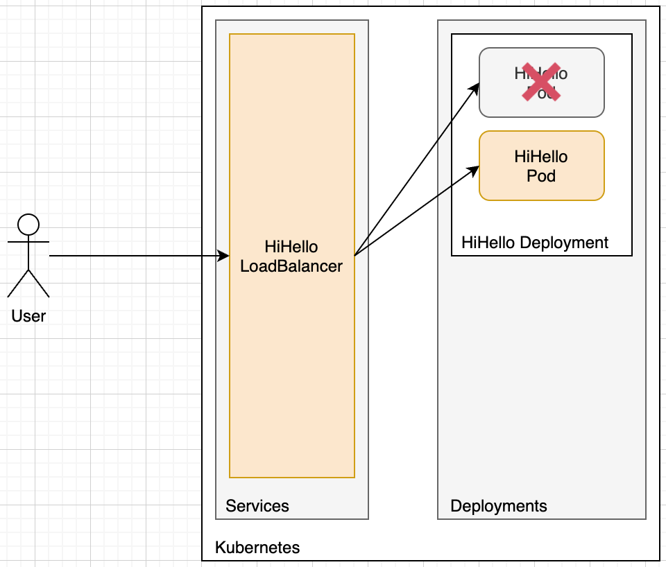

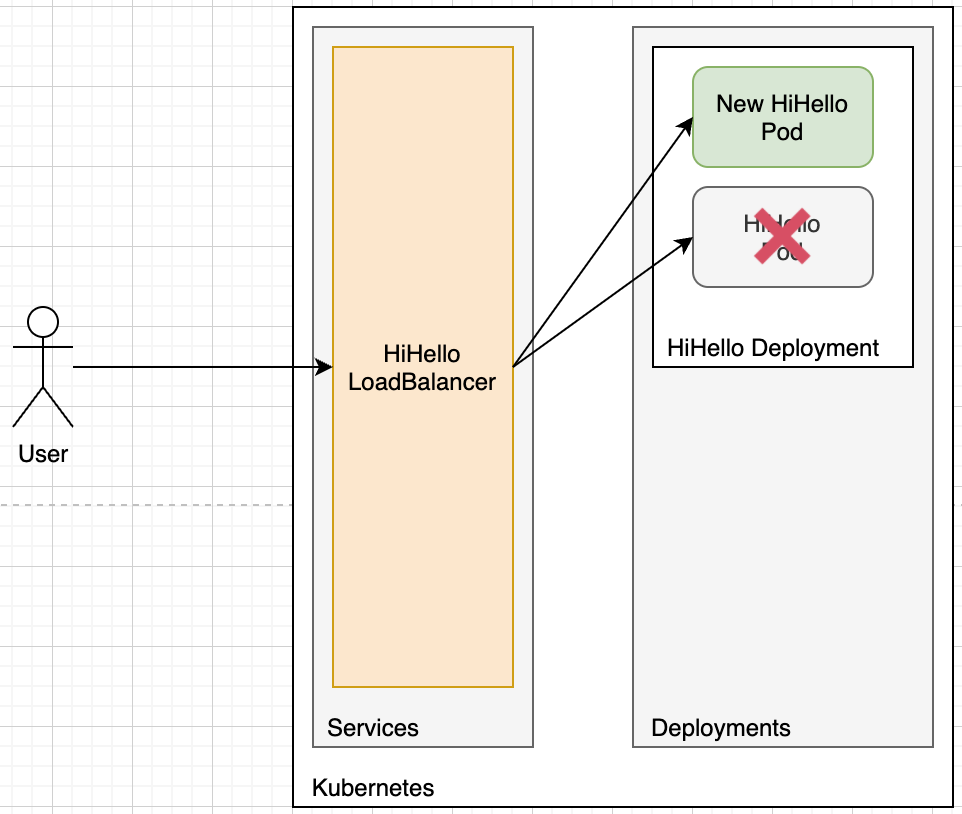

하나씩 새 Pod로 교체하는 방식이라, 기존에 켜져있던 모든 서버가 꺼지지 않습니다.

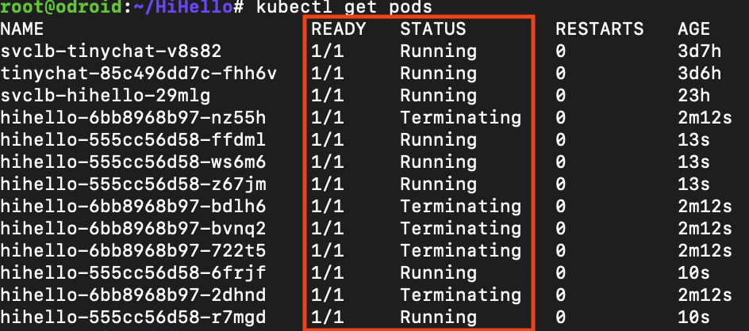

새로운 서버로 하나씩 교체되는 중..

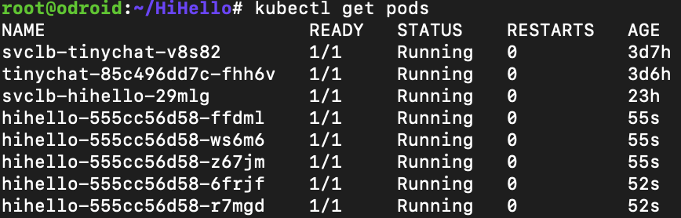

교체가 완료되었습니다!

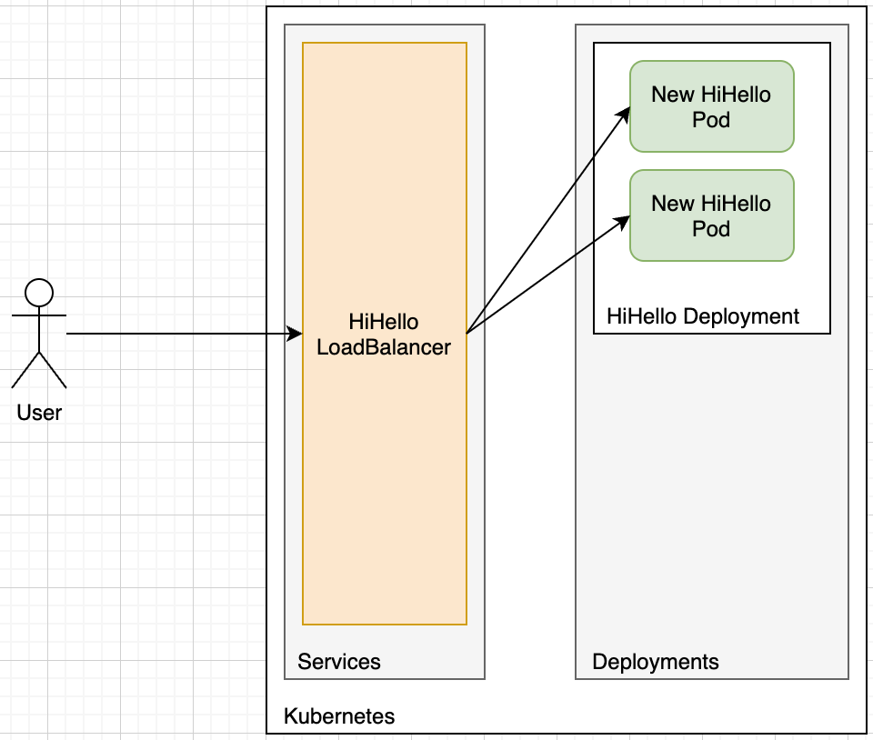

고객에게 피해없이 모든 서비스를 새거로 바꾸는데 성공했습니다!

## 이 배포는 추가 옵션이 있습니다.

* minReadySeconds : pod이 Ready 단계 부터 Available 단계 까지 식단 차이 시간을 설정하지 않으면 ready에서 곧바로 avaliable이 되고 순단 현상이 일어난다. 적절한 시간을 테스트하여 설정하는 것이 좋다.

* strategy.type : “Recreate” or “RollingUpdate”를 설정가능. 기본값은 “RollingUpdate”, Recreate의 경우 Pod가 삭제된 후 재생성

* strategy.rollingUpdate.maxSurge : rolling update 중 정해진 Pod 수 이상으로 만들 수 있는 Pod의 최대 개수. 기본값은 25%

* strategy.rollingUpdate.maxUnavailable : rolling update 중 unavailable 상태인 Pod의 최대 개수를 설정. rollgin update 중 사용할 수 없는 Pod의 최대 개수. 값은 0보다 큰 정수를 통해 Pod의 절대 개수 설정이 가능하고, “25%“와 같이 percentage 표현 가능 . maxUnavailable에서 percentage 계산은 rounding down(내림) 방식이며 기본값은 25% 이다. maxSurge와 maxUnavailable 값이 동시에 0이 될 수 없다.

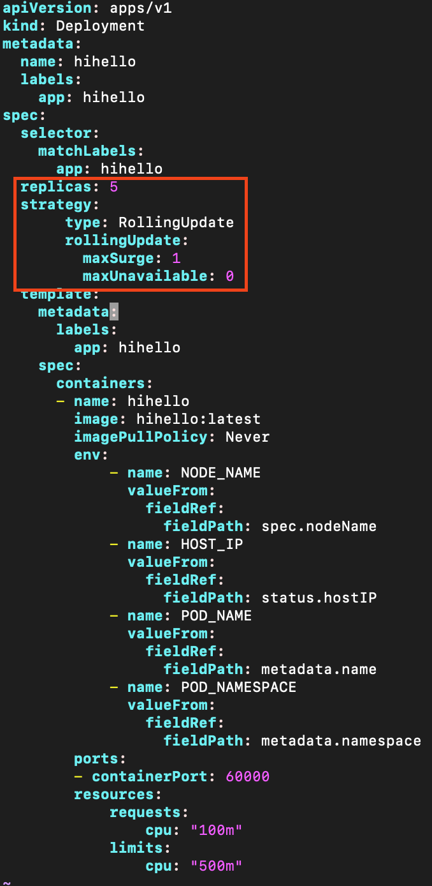

maxSurge와 maxUnavailable 값을 설정하여, 한번에 반드시 하나의 Pod를 업데이트 할 수 있으며  
모든 Replica는 Available 해야한다는 것을 명시했습니다. (Replicas가 5면, 항상 5개의 Pod가 띄워져 있어야 함을 의미함)

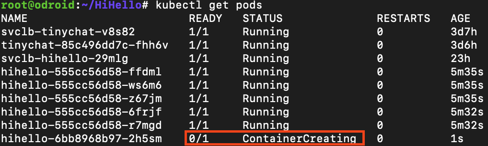

maxUnavailable이 0이어서, Terminate를 먼저 하지 않습니다.  
Create부터 먼저 합니다!

> 항상 5개의 Pod를 유지해야 하기 때문

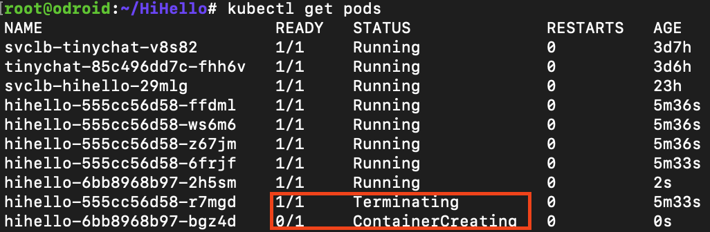

이후 Pod를 한개씩 한개씩 천천히 안전하게 바꿔나가기 시작합니다.

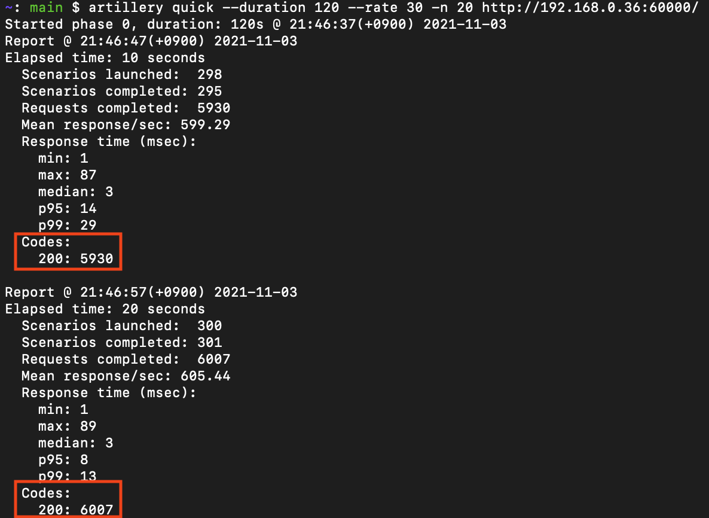

부하를 줬을때, 모든 요청이 정상적으로 처리되는 것을 볼 수 있습니다!

## 결론

롤링 배포는 띄워져있는 Pod의 수가 많을수록 서비스 배포에 많은 시간이 소요된다는 단점이 있습니다.  
이는 새 서버에 문제가 생겨서 롤백하는데에도 많은 시간이 걸린다는 뜻인데요.

하지만, 이후 설명할 다른 배포들과는 다르게 크게 신경쓸게 없어서 배포하기 정말 편하다는 장점이 있습니다.

또한, 새 서버 배포에 서버 자원을 최소한으로 사용합니다.

그렇지만.. 배포에 많은 시간이 걸린다는 단점이 워낙 큰지라 이를 해결하기 위해 "블루 그린 배포" 방법이 생겨났습니다.

다음 문서에서는 이 단점을 보완하는 배포 방법에 대해서 알아보도록 하겠습니다.
