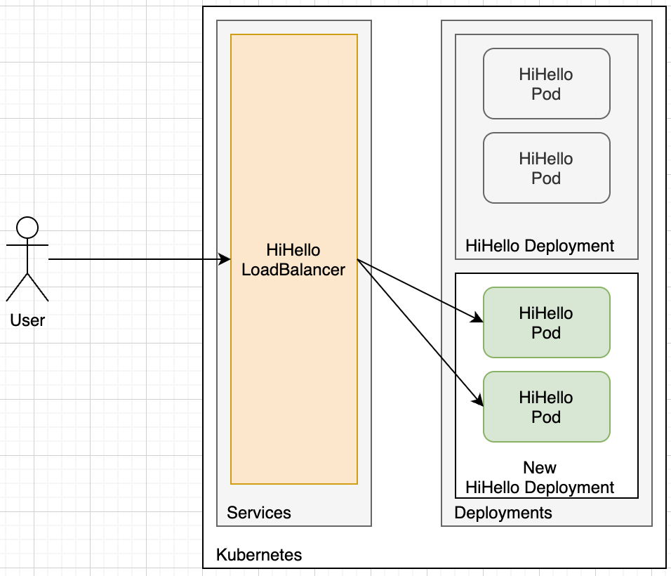

# 한번에 새거 싹 다 키고, 한번에 헌거 싹 다 끄기

## 결론

새 서버 배포에 서버 자원을 많이 쓴다는 단점이 있습니다.

다만, 새 서버로 교체되는 시간이 비교적 굉장히 짧으며 사이드 이펙트가 상당히 적다는 장점이 있습니다.

새 서버가 라이브 환경에서 정상적으로 동작하는지 확인 할 겨를이 없이 라이브로 교체된다는 문제가 있어서 "카나리 배포"가 생겨났습니다.

다음 문서에서는 "카나리 배포"에 대해서 알아보도록 하겠습니다.
