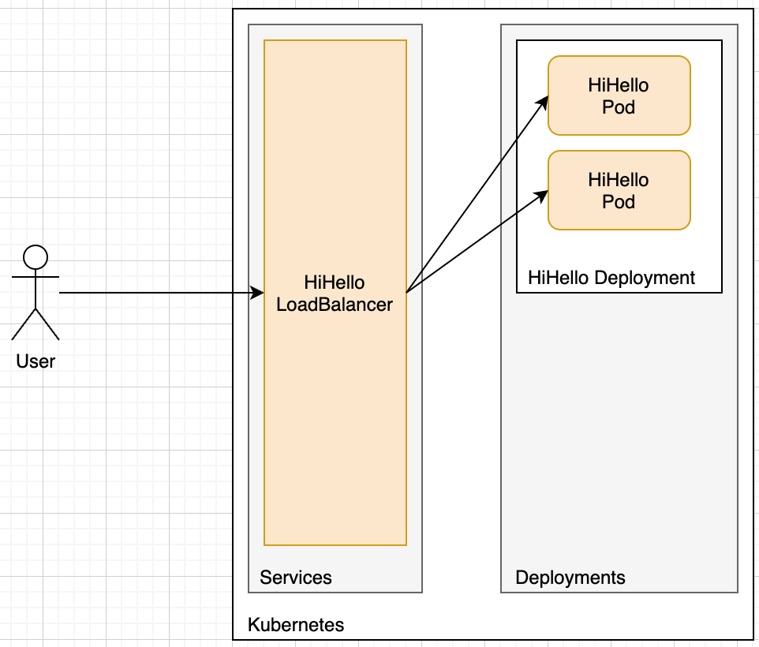
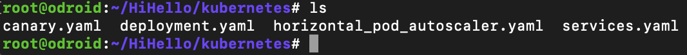
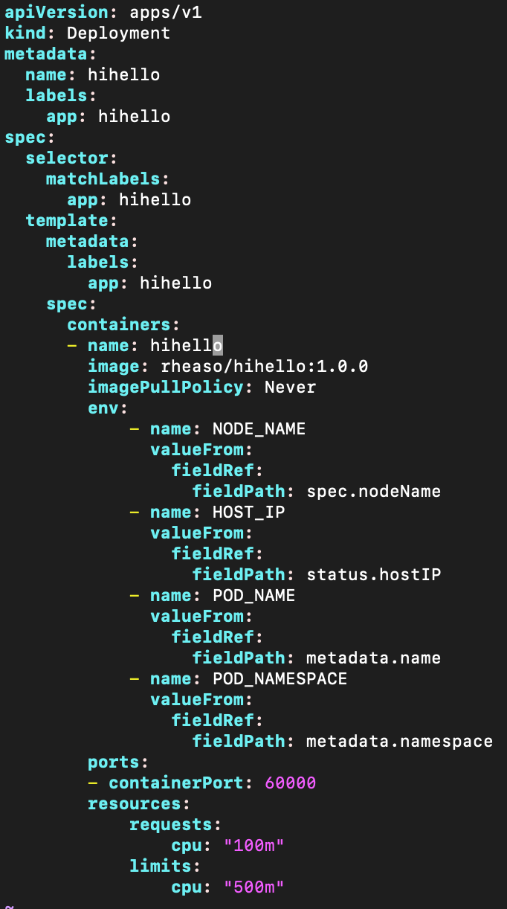
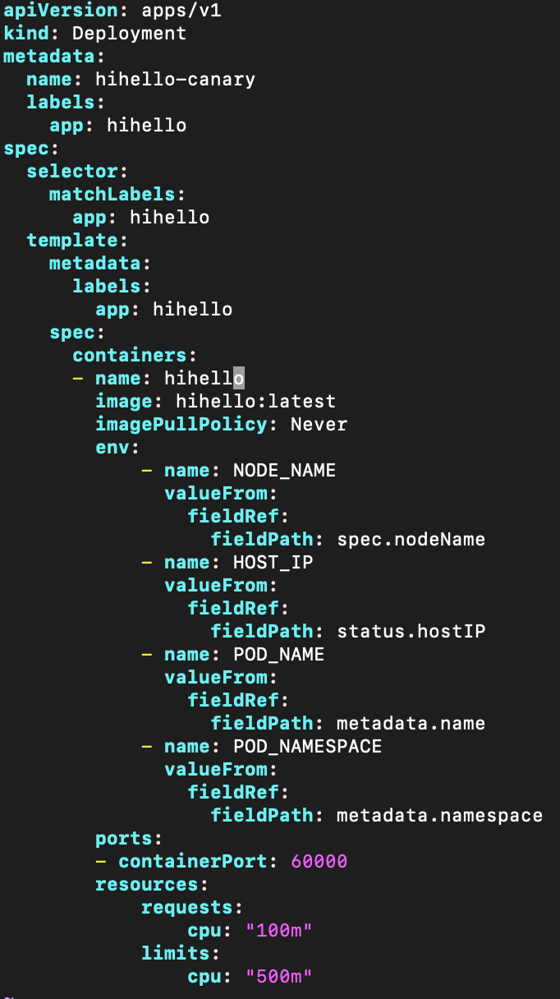
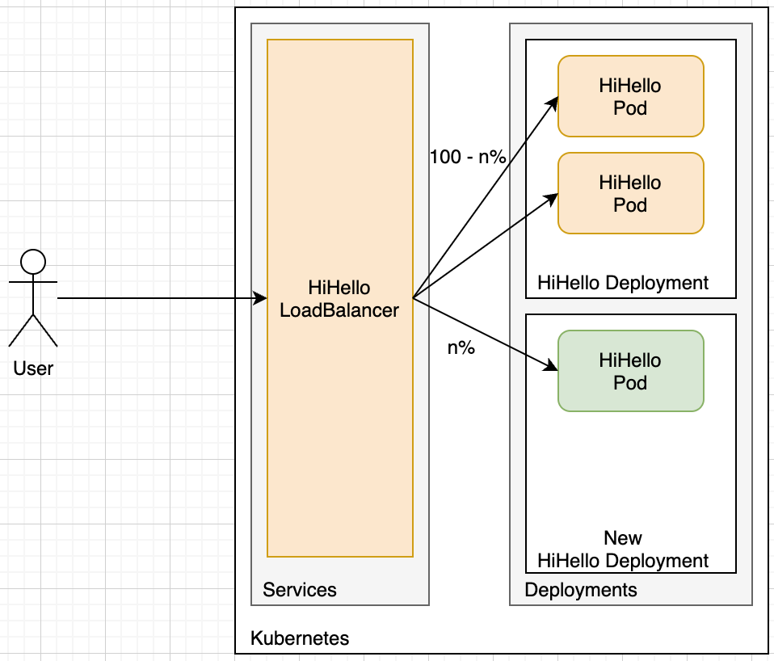
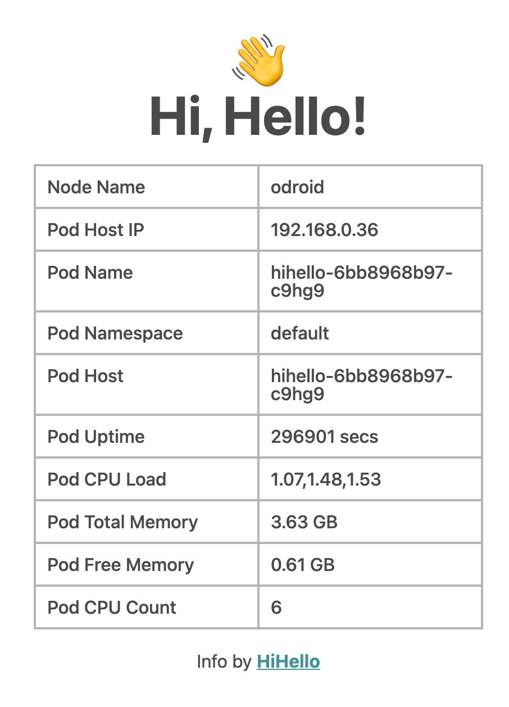
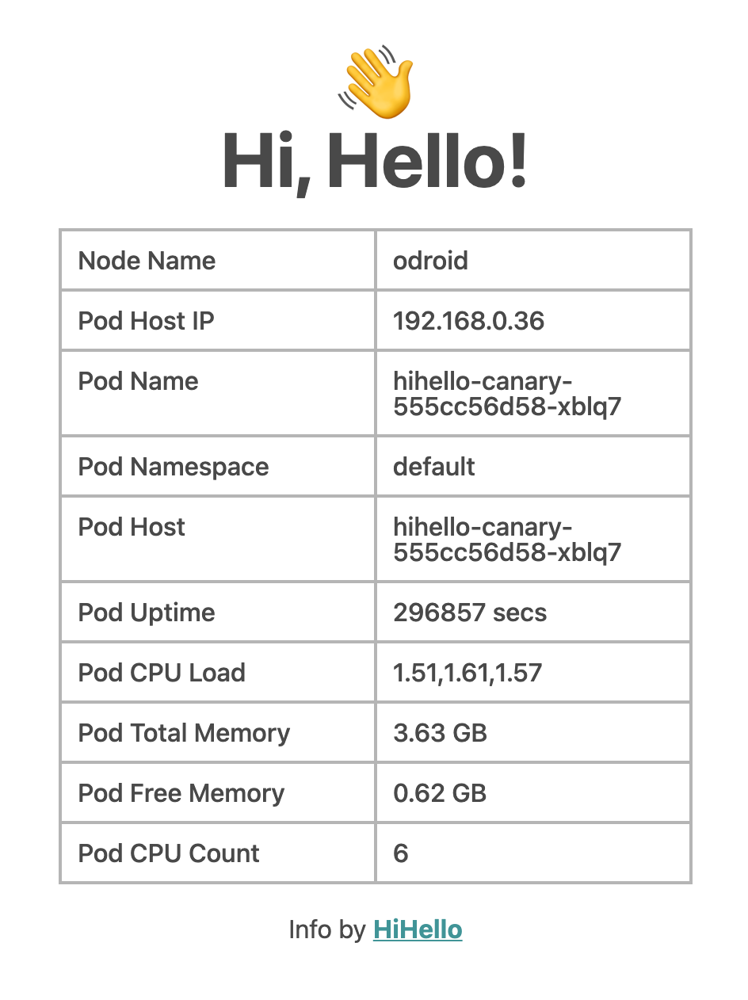
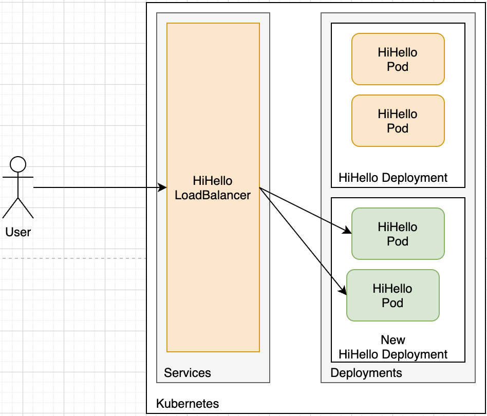
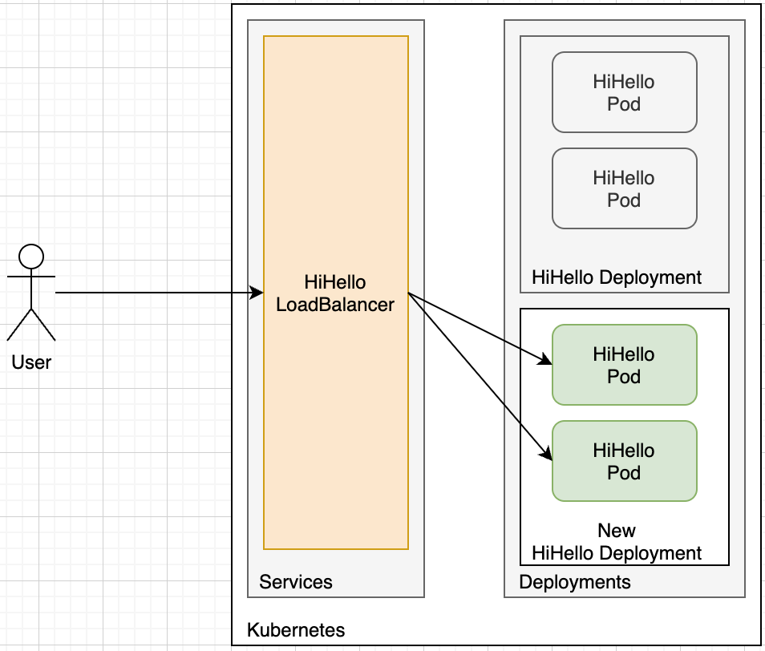

# 새거 먼저 넣고 테스트 해보기

## 결론

새 서버를 라이브에서 테스트해보고,  
문제가 없으면 모든 서버를 새 서버로 교체하는 방식입니다.

라이브에서 카나리 덕분에 장애를 빠르게 파악할 수 있습니다.

큰 장애를 사전에 방지할 수 있습니다.

## 참고

[Kubernetes Label을 이용한 카나리(Canary) 배포](https://arisu1000.tistory.com/27842)
